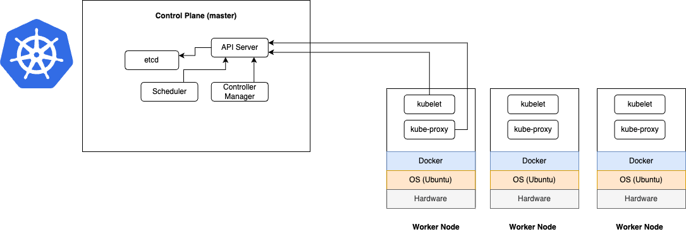

# kubernetes-learn

Architecture of a Kubernetes cluster

## Master Node
- API Server - what you (using kubectl) and other components of the control plane communicate with..
- Scheduler - this determines which worker node to create the pod in.
- Controller Manager - performs cluster-level functions, such as, replicating components, keeping track of worker nodes, handling node failures, etc.
- etcd - data store that persistently stores the cluster configuration.

## Worker Node
- Docker - container runtime, what runs your containers.
- Kubelet - talks to the API server and manages containers on its node.
- Kube-proxy - load-balances network traffic between application components.

## Tutorials
Video I watched to learn about k8s: [YouTube](https://youtu.be/7bA0gTroJjw?si=pjLvUtUuKT6ATTXX)

## Steps to connect to master node
1. install kubectl on your machine
2. run nano or vim, create file call kubeconfig.yml
3. copy/paste kubeconfig of k8 cluster into your kubeconfig.yml
4. add environment variable KUBECONFIG=kubeconfig.yml
5. start running kubectl commands!

## Common kubectl commands

- kubectl cluster-info
- kubectl describe pods
- kubectl describe services
- kubectl get nodes
- kubectl get deployments
- kubectl get pods
- kubectl get pods -o wide
- kubectl get services
- kubectl apply -f example-service.yml
- kubectl run mytestpod --image=thenetworkchuck/nccoffee:pourover --port=80